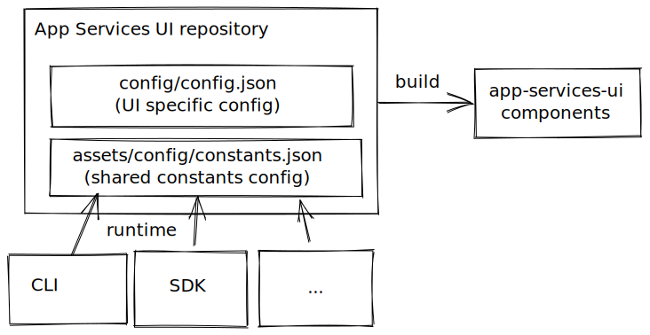

## Dynamic configuration folder

This folder contains dynamic configurations for UI and CLI.
UI will load configuration on build and other clients will load them using the 

## Usage 

### Inside UI

TODO - add hook

### Dynamic using url

```
curl https://console.redhat.com/apps/application-services/service-constants.json
```

## Architecture


